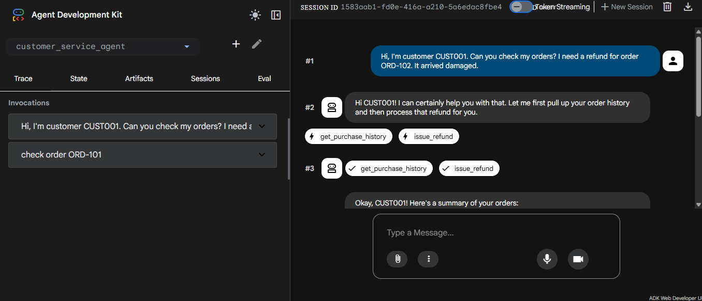

# 🤖 AI Customer Service Agent with Evaluation Pipeline

This project is an AI-powered customer service agent built using Google ADK, designed to simulate and evaluate customer interactions automatically.

## 📸 Demo



---

## 📊 Evaluation Results

- ✅ All test scenarios passed
- 🎯 Tool usage accuracy: 1.0
- 📈 Response match score: ~0.55 - 0.66

## Example:
Overall Eval Status: PASSED
tool_trajectory_avg_score: 1.0
response_match_score: 0.66

## 🚀 Project Overview

The system acts as an intelligent customer support assistant that:
- Responds to user queries
- Simulates real-world customer service scenarios
- Evaluates responses using an automated evaluation pipeline

---

## 🧠 Features

- ✅ AI-powered conversational agent
- ✅ Automated evaluation system
- ✅ Scenario-based testing
- ✅ Scalable architecture using Google ADK
- ✅ Test-driven evaluation with pytest

---

## 🛠️ Technologies Used

- Python
- Google Agent Development Kit (ADK)
- Pytest
- Git & GitHub

---

## 📊 Evaluation Pipeline
```bash
customer_service_agent/
├── main.py
├── eval/
├── tests/
├── .env
├── README.md

```
---

## ▶️ How to Run

1. Clone the repository:
```bash
git clone https://github.com/beyzauzun-ai/customer-service-ai-agent.git
```
### Navigate to the project:
cd customer-service-ai-agent

### ⛓️‍💥 Install dependencies:
pip install -r requirements.txt

### 🎯 Purpose

This project was developed as part of an AI learning journey to gain hands-on experience in:

## AI agent design
Evaluation pipelines
Real-world AI applications

## 📌 Future Improvements
Add UI interface
Improve response accuracy
Integrate with real APIs
Deploy as a web service

### 👩‍💻 Author

Beyza Uzun

AI & Data Enthusiast
